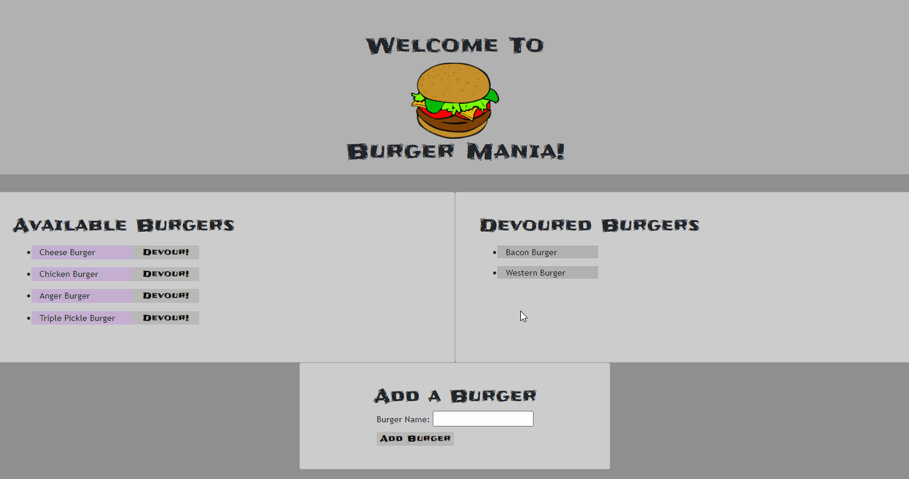

  
  # Burger Mania

  <h2>Description:</h2> full stack application deployed on Heroku for creating "burgers" in database and changing their state dynamically 

  <h2>Table of Contents:</h2> 

  [Installation](#install)

  [Usage](#usage)

  [License](#license)

  [Contributing](#contributing)

  [Tests](#tests)

  [Questions](#questions)

  [Demonstration](#demonstration)

   

  <h3><a name="install">Installation:</a></h3>

  please be sure to install all dependencies and add a .env with your local password

  <h3><a name="usage">Usage:</a></h3>

  please use as you see fit. deployed application on heroku can be found here: [https://stark-caverns-19912.herokuapp.com/](https://stark-caverns-19912.herokuapp.com/)

  <h3><a name="liscense">License:</a></h3>

  This work is covered under the CC0 1.0 Universal license.

  Full license information can be found here: [License: CC0-1.0](http://creativecommons.org/publicdomain/zero/1.0/)

  <h3><a name="contributing">Contributing:</a></h3> 

  feel free to fork me!

  <a name="tests"><h3>Tests:</h3></a> 

  no tests exist at this time

  <a name="questions"><h3>Questions:</h3></a>  

  gitHub Name: forgetfulmind

  gitHub Link: <a href="https://github.com/forgetfulmind">https://github.com/forgetfulmind</a>

  eMail: forgetfulmind@gmail.com

  <a name="demonstration"><h3>Demonstration:</h3></a>  

